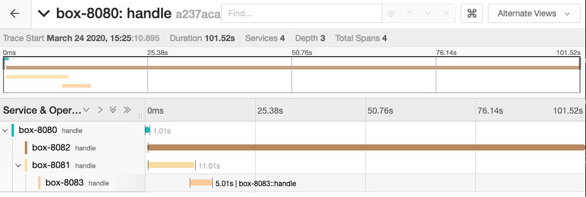

# Working Box

This project is a simple service that burns resources during a
configurable time and call other services doing the same. They can
report their execution to a [Jaeger tracing
service](https://www.jaegertracing.io/). This builds a configurable
workflow that can be checked, and used at runtime or postmortem. Along
with energy monitoring of services, the latter gain insight of their
energy consumption and adapt their behavior to user-defined desires.

## Usage

Either by modifying the ```application.properties``` file or
environment variable. The following command starts the
service ```box-8080```
(names must be unique for tracing purposes), with a configurable time (ms)
depending on the second input parameter ```x``` such
that ```f(x)= 2000 + 10x``` plus ```g( )= 1000```. 
At 80 percent of the execution time, the service calls two other services
with the same inputs. 

```
BOX_ENERGY_THRESHOLD_BEFORE_SELF_TUNING_ARGS=4 \
BOX_ENERGY_CALL_URL=http://localhost:5000/ \
JAEGER_ENDPOINT=http://192.168.99.100:14268/api/traces \
SPRING_APPLICATION_NAME=box-8080 \
SERVER_PORT=8080 \
BOX_POLYNOMES_COEFFICIENTS=1000-2000,10@1 \
BOX_REMOTE_CALLS=http://localhost:8081@80,http://localhost:8082@80 \
mvn spring-boot:run
```

To call this service: ```curl "http://localhost:8080?args=10,20"```

By chaining boxes, the result on Jaeger looks like the screenshot
below. A first box calls two other boxes at 80% of its 1s workflow. A
second box executes its workflow during ~100s. A third box calls a
fourth one at 80% of its 11s workflow. The forth box execution time is
5s.



## Energy consumption awareness

Second part of this project is about providing energy consumption
awareness to services. We monkey-patch an HTTP interceptor with
autonomic capabilities [1] in front of every endpoint with
peer-to-peer capabilities to efficiently propagate energy data between
related services [4].

Front-ends propose to users multiple modes of energy consumption to
users depending on underlying services of the application. Users
choose their energy objective. Network messages carry objectives in
their header. Each service fairly splits energy objectives  
between itself and subsequent services. Each service chooses its
arguments that results in the closest energy consumption to its own
objective.

```curl -H "objective: 1000" "http://localhost:8080?args=10,20"```

Internally, each service (i) discovers, updates, or self-tunes
arguments depending on a counting bloom filter [2]; (ii) monitors and
keeps only relevant arguments with configurable accuracy; (iii) fairly
splits an incoming objective into sub-objectives by solving
exactly-once multiple-choice knapsack problem [3] using dynamic
programming.

## References

[1] Jeffrey O. Kephart, and David M. Chess. The vision of autonomic
computing. <i>IEEE Computer Society</i>, 2003.

[2] Li Fan, Pei Cao, Jussara Almeida, and Andrei Broder.  Summary
Cache: A Scalable Wide-Area Web Cache Sharing Protocol. <i>IEEE/ACM
Transactions on Networking</i>, 2000.

[3] Toshihide Ibaraki, and Toshiharu Hasegawa. The Multiple-choice
knapsack problem. <i>Journal of the Operations Research Society of
Japan</i>, 1978.

[4] Anne-Marie Kermarrec, and François Taïani. Want to scale in
centralized systems? Think P2P. <i>Journal of Internet Services and
Applications</i>, 2015.
